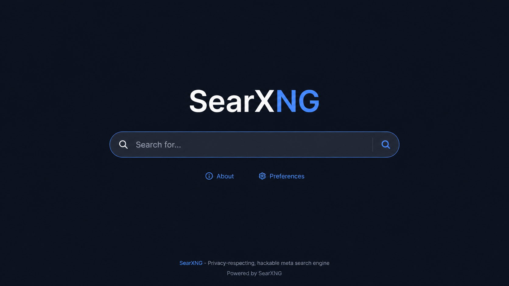
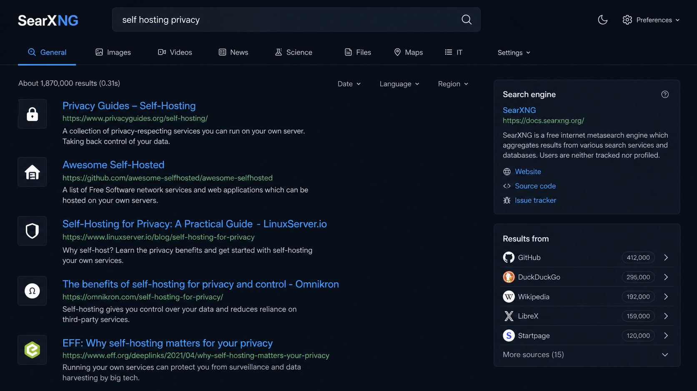
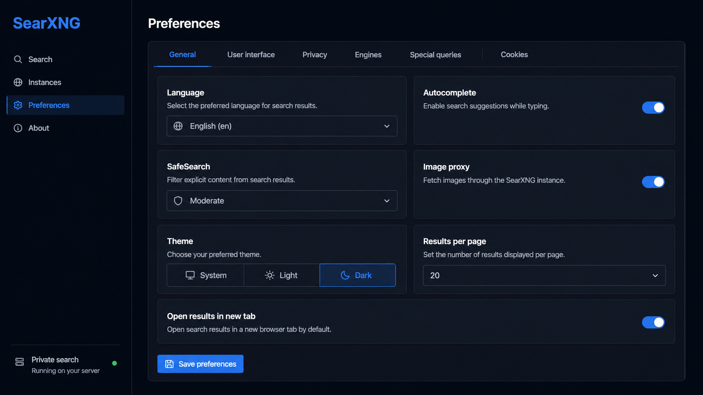
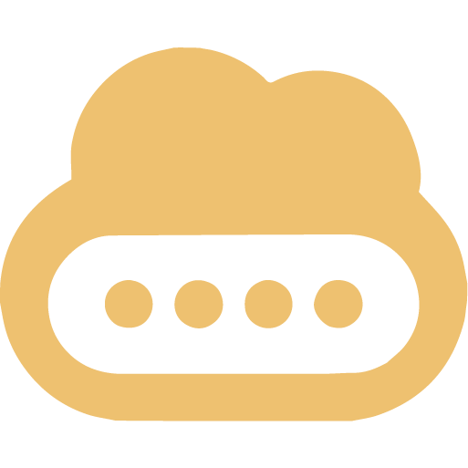
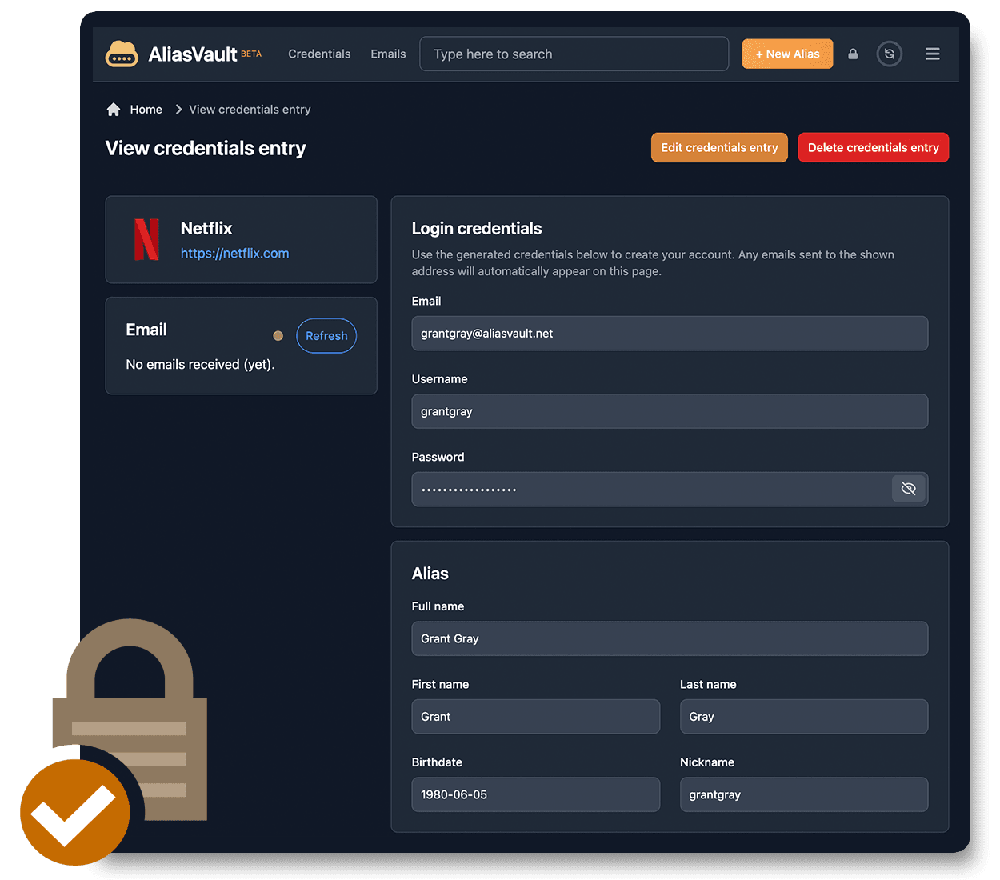
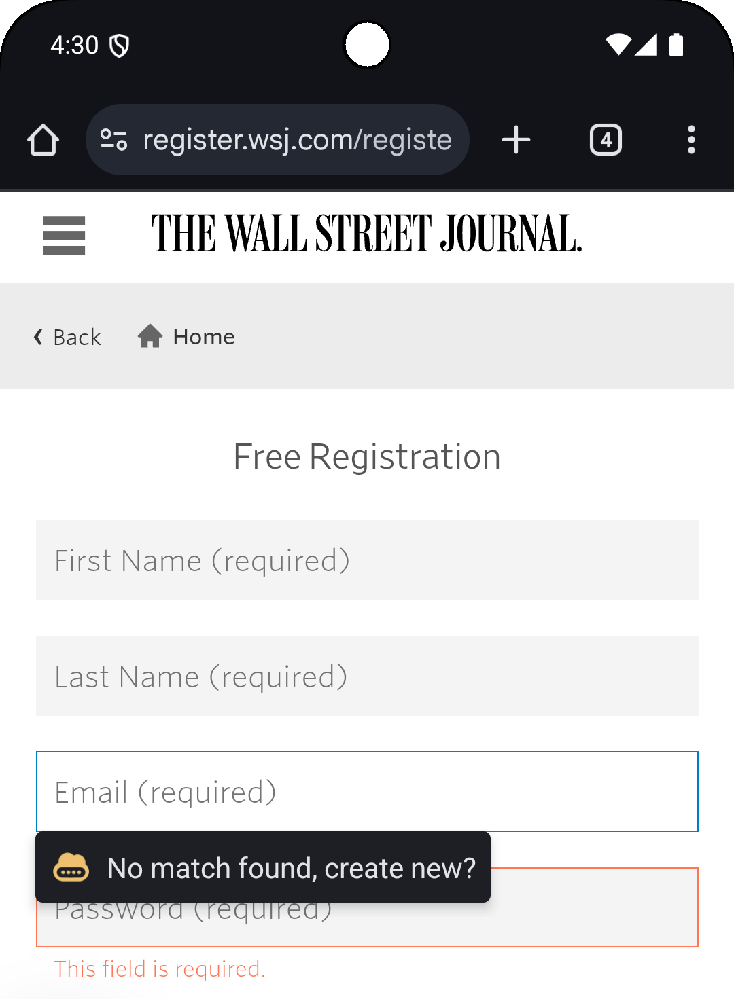

# DutchLiquid ZimaOS Community Store

A carefully packaged community app store for ZimaOS, maintained by [DutchLiquid](https://github.com/dutchliquid).

## Add the store to ZimaOS

In current ZimaOS versions, open **App Store → Settings → Custom App Store**, then add this v2 store source:

```text
https://cdn.jsdelivr.net/gh/dutchliquid/zimaos-community-store@gh-pages/store.json
```

The source is generated by the official `IceWhaleTech/build-appstore-action` and published automatically to the `gh-pages` branch whenever `main` changes.

For ZimaOS/CasaOS versions that still expect the legacy ZIP-style source, use:

```text
https://github.com/dutchliquid/zimaos-community-store/archive/refs/heads/main.zip
```

Do not append `.zip` directly to the repository URL; GitHub branch archives use the `/archive/refs/heads/main.zip` path shown above.

## Available apps

### SearXNG


SearXNG is a privacy-respecting, self-hosted metasearch engine that combines results from many providers without building an advertising profile. The package uses portable ZimaOS storage and includes no hardware-specific memory limit.

| Setting | Default |
| --- | --- |
| Web interface | `http://[ZimaOS-IP]:8099` |
| Persistent data | `/DATA/AppData/$AppID/` |
| Public instance mode | Disabled |
| Image proxy | Disabled |

Before installation, replace `SEARXNG_SECRET` with a long random value. When using a domain or reverse proxy, also replace `SEARXNG_BASE_URL` with the complete public URL.

#### Screenshots







### AliasVault



AliasVault is a privacy-first, open-source password and email alias manager. It gives every website a unique identity, password, and email alias while keeping sensitive vault data end-to-end encrypted. The all-in-one image includes the web app, API, database, administration panel, mail server, and reverse proxy.

| Setting | Default |
| --- | --- |
| Web interface | `http://[ZimaOS-IP]:84` |
| HTTPS interface | `https://[ZimaOS-IP]:4443` |
| Persistent data | `/DATA/AppData/$AppID/` |
| Registration | Enabled for first-time setup |
| Mail ports | `25` and `587` |

After the administrator account is created, set `PUBLIC_REGISTRATION_ENABLED` to `false`. Mail ports are only required if you plan to receive alias email on your own domain.

#### Screenshots






## Repository layout

```text
Apps/
  AliasVault/
    docker-compose.yml
    icon.png
    thumbnail.png
    screenshot-1.png
    screenshot-2.png
    screenshot-3.png
  SearXNG/
    docker-compose.yml
    icon.png
    thumbnail.png
    screenshot-1.png
    screenshot-2.png
    screenshot-3.png
category-list.json
recommend-list.json
```

Each app follows the ZimaOS AppStore v2/CasaOS schema, has a stable reverse-domain ID, and uses ZimaOS's neutral `/DATA/AppData/$AppID` storage convention.

## Upstream projects

- [AliasVault](https://github.com/aliasvault/aliasvault)
- [ZimaOS](https://www.zimaspace.com/zimaos/)
- [CasaOS AppStore schema](https://github.com/IceWhaleTech/CasaOS-AppStore)
