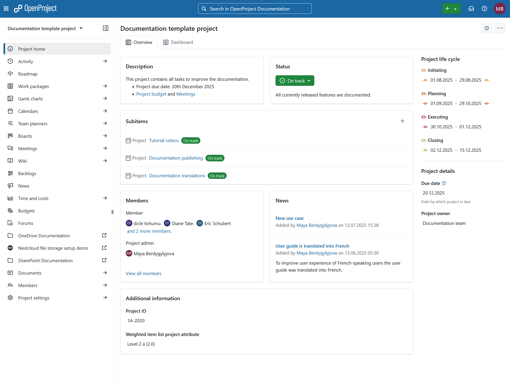
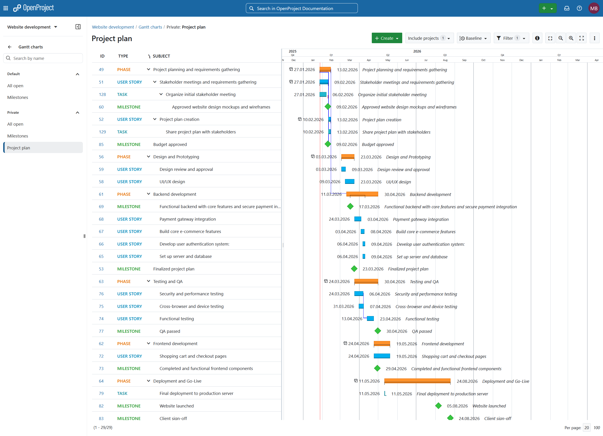
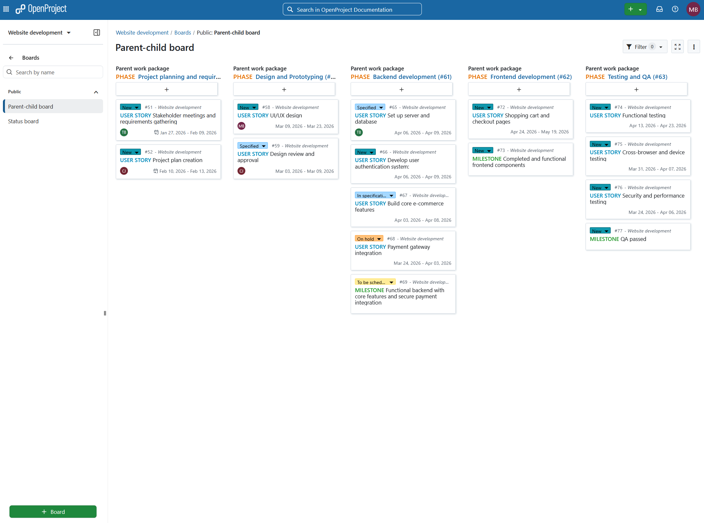

# DutchLiquid ZimaOS Community Store

A carefully packaged community app store for ZimaOS, maintained by [DutchLiquid](https://github.com/dutchliquid).

Store and app metadata are available in English, Dutch, German, French, Spanish, and Italian.

## Add the store to ZimaOS

In current ZimaOS versions, open **App Store → Settings → Custom App Store**, then add this v2 store source:

```text
https://cdn.jsdelivr.net/gh/dutchliquid/zimaos-community-store@gh-pages/store.json
```

The source is generated by the official `IceWhaleTech/build-appstore-action` and published automatically to the `gh-pages` branch whenever `main` changes.

For ZimaOS/CasaOS versions that still expect the legacy ZIP-style source, use:

```text
https://cdn.jsdelivr.net/gh/dutchliquid/zimaos-community-store@gh-pages/store/main.zip
```

The legacy archive is generated from the same app definitions as the v2 catalog, so both sources contain the same applications.

### Published JSON files

ZimaOS starts with [store.json](https://cdn.jsdelivr.net/gh/dutchliquid/zimaos-community-store@gh-pages/store.json). The generated application indexes contain the complete app list and localized descriptions:

- [English app index](https://cdn.jsdelivr.net/gh/dutchliquid/zimaos-community-store@gh-pages/index.json)
- [Dutch app index](https://cdn.jsdelivr.net/gh/dutchliquid/zimaos-community-store@gh-pages/index.nl_NL.json)
- [German app index](https://cdn.jsdelivr.net/gh/dutchliquid/zimaos-community-store@gh-pages/index.de_DE.json)
- [French app index](https://cdn.jsdelivr.net/gh/dutchliquid/zimaos-community-store@gh-pages/index.fr_FR.json)
- [Spanish app index](https://cdn.jsdelivr.net/gh/dutchliquid/zimaos-community-store@gh-pages/index.es_ES.json)
- [Italian app index](https://cdn.jsdelivr.net/gh/dutchliquid/zimaos-community-store@gh-pages/index.it_IT.json)

Localized `store.*.json` metadata files are published alongside these indexes. All JSON files are generated automatically from the Compose definitions on `main`.

## Available apps

### Apache Superset


Apache Superset is an open-source business-intelligence platform for exploring data and building interactive charts and dashboards. This ZimaOS package uses Apache Superset 6.0.0 in a lightweight single-node configuration with a persistent SQLite metadata database.

| Setting | Default |
| --- | --- |
| Web interface | `http://[ZimaOS-IP]:8088` |
| Persistent data | `/DATA/AppData/$AppID/superset_home` |
| Metadata database | SQLite |
| Initial username | `admin` |
| Initial password | `supersetadmin` |

Change the initial password immediately after signing in. The initialization service only creates the administrator when needed and will not reset a password that you change later. This lightweight profile does not include Redis or Celery, so scheduled and asynchronous features are unavailable. Some optional database drivers may require a custom Superset image.

#### Screenshots


### OpenProject


OpenProject Community Edition is an open-source project-management platform for traditional, agile, and hybrid teams. The ZimaOS package uses the official all-in-one OpenProject 17.6.0 image and portable storage for its embedded PostgreSQL database and uploaded files.

| Setting | Default |
| --- | --- |
| Web interface | `http://[ZimaOS-IP]:8083` |
| Persistent data | `/DATA/AppData/$AppID/` |
| Default language | English |
| HTTPS | Disabled for local setup |

Before installation, set `OPENPROJECT_HOST__NAME` to the address you will use and replace `SECRET_KEY_BASE` with a random 128-character value. The first startup can take several minutes; then sign in with `admin` / `admin` and change the password immediately.

#### Screenshots







### SearXNG


SearXNG is a privacy-respecting, self-hosted metasearch engine that combines results from many providers without building an advertising profile. The package uses portable ZimaOS storage and includes no hardware-specific memory limit.

| Setting | Default |
| --- | --- |
| Web interface | `http://[ZimaOS-IP]:8099` |
| Persistent data | `/DATA/AppData/$AppID/` |
| Public instance mode | Disabled |
| Image proxy | Disabled |

Before installation, replace `SEARXNG_SECRET` with a long random value. When using a domain or reverse proxy, also replace `SEARXNG_BASE_URL` with the complete public URL.

#### Screenshots


### AliasVault


AliasVault is a privacy-first, open-source password and email alias manager. It gives every website a unique identity, password, and email alias while keeping sensitive vault data end-to-end encrypted. The all-in-one image includes the web app, API, database, administration panel, mail server, and reverse proxy.

| Setting | Default |
| --- | --- |
| Web interface | `http://[ZimaOS-IP]:84` |
| HTTPS interface | `https://[ZimaOS-IP]:4443` |
| Persistent data | `/DATA/AppData/$AppID/` |
| Registration | Enabled for first-time setup |
| Mail ports | `25` and `587` |

After the administrator account is created, set `PUBLIC_REGISTRATION_ENABLED` to `false`. Mail ports are only required if you plan to receive alias email on your own domain.

#### Screenshots


## Repository layout

```text
Apps/
  AliasVault/
    docker-compose.yml
    icon.png
    thumbnail.png
    screenshot-1.png
    screenshot-2.png
    screenshot-3.png
  ApacheSuperset/
    docker-compose.yml
  SearXNG/
    docker-compose.yml
    icon.png
    thumbnail.png
    screenshot-1.png
    screenshot-2.png
    screenshot-3.png
  OpenProject/
    docker-compose.yml
    icon.png
    thumbnail.png
    screenshot-1.png
    screenshot-2.png
    screenshot-3.png
category-list.json
recommend-list.json
```

Each app follows the ZimaOS AppStore v2/CasaOS schema, has a stable reverse-domain ID, and uses ZimaOS's neutral `/DATA/AppData/$AppID` storage convention. Generated JSON metadata, downloaded artwork, architecture-specific Compose files, and the legacy ZIP are published on the `gh-pages` branch.

## Upstream projects

- [AliasVault](https://github.com/aliasvault/aliasvault)
- [Apache Superset](https://github.com/apache/superset)
- [SearXNG](https://github.com/searxng/searxng)
- [OpenProject](https://github.com/opf/openproject)
- [ZimaOS](https://www.zimaspace.com/zimaos/)
- [CasaOS AppStore schema](https://github.com/IceWhaleTech/CasaOS-AppStore)
